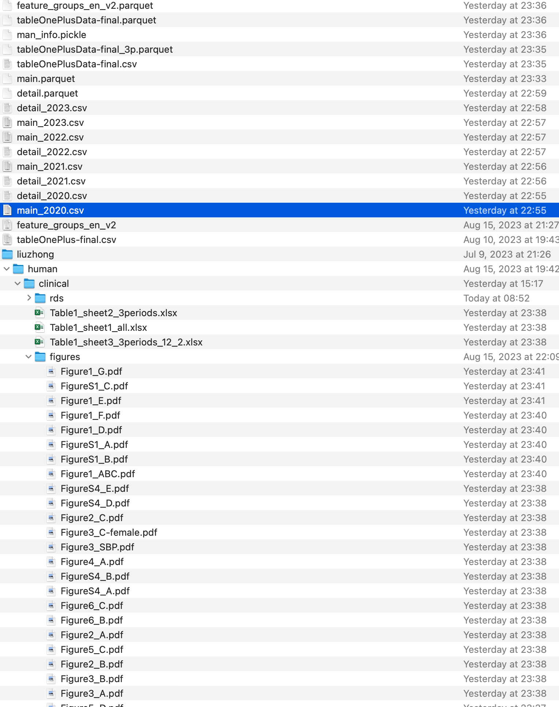

# Code

Run the whole project:

```
bash run.sh
```

All figures and tables will be placed on ./analysis folder:



## 1. data pre-processing


### 1.1. read rds files

convert RDS to csv

```
00.read_rds_files.R
```


#### input

```
# health check item data
/cluster/home/jhuang/projects/healthman/analysis/liuzhong/human/clinical/rds/detail_2020.rds
/cluster/home/jhuang/projects/healthman/analysis/liuzhong/human/clinical/rds/detail_2021.rds
/cluster/home/jhuang/projects/healthman/analysis/liuzhong/human/clinical/rds/detail_2022.rds
/cluster/home/jhuang/projects/healthman/analysis/liuzhong/human/clinical/rds/detail_2023.rds

# health check people data
/cluster/home/jhuang/projects/healthman/analysis/liuzhong/human/clinical/rds/main_2020.rds
/cluster/home/jhuang/projects/healthman/analysis/liuzhong/human/clinical/rds/main_2021.rds
/cluster/home/jhuang/projects/healthman/analysis/liuzhong/human/clinical/rds/main_2022.rds
/cluster/home/jhuang/projects/healthman/analysis/liuzhong/human/clinical/rds/main_2023.rds
```

#### output

```
# health check item data
/cluster/home/bqhu_jh/projects/healthman/analysis/detail_2020.csv
/cluster/home/bqhu_jh/projects/healthman/analysis/detail_2021.csv
/cluster/home/bqhu_jh/projects/healthman/analysis/detail_2022.csv
/cluster/home/bqhu_jh/projects/healthman/analysis/detail_2023.csv

# health check people data
/cluster/home/bqhu_jh/projects/healthman/analysis/main_2020.csv
/cluster/home/bqhu_jh/projects/healthman/analysis/main_2021.csv
/cluster/home/bqhu_jh/projects/healthman/analysis/main_2022.csv
/cluster/home/bqhu_jh/projects/healthman/analysis/main_2023.csv
```

### 1.2. from longer to wider

```
0.generate_tableOnePlus.ipynb
```

#### input

```
# describe feature we used
/cluster/home/bqhu_jh/projects/healthman/analysis/tableOnePlus-final.csv

# describe English names for items
/cluster/home/bqhu_jh/projects/healthman/analysis/feature_groups_en_v2.csv

# health check item-people data
/cluster/home/bqhu_jh/projects/healthman/analysis/detail_2020.csv
/cluster/home/bqhu_jh/projects/healthman/analysis/detail_2021.csv
/cluster/home/bqhu_jh/projects/healthman/analysis/detail_2022.csv
/cluster/home/bqhu_jh/projects/healthman/analysis/detail_2023.csv
/cluster/home/bqhu_jh/projects/healthman/analysis/main_2020.csv
/cluster/home/bqhu_jh/projects/healthman/analysis/main_2021.csv
/cluster/home/bqhu_jh/projects/healthman/analysis/main_2022.csv
/cluster/home/bqhu_jh/projects/healthman/analysis/main_2023.csv
```

#### output

```
# tidy-style result
/cluster/home/bqhu_jh/projects/healthman/analysis/tableOnePlusData-final.csv

# parquet for tidy-style result
/cluster/home/bqhu_jh/projects/healthman/analysis/tableOnePlusData-final.parquet

# select 3-periods people, rev month info among diff years
/cluster/home/bqhu_jh/projects/healthman/analysis/tableOnePlusData-final_3p.parquet

/cluster/home/bqhu_jh/projects/healthman/analysis/feature_groups_en_v3.parquet
/cluster/home/bqhu_jh/projects/healthman/analysis/man_info.pickle
```


## 2. basic analysis

### 2.1. Table1


Table1.ipynb


#### input

parquet for tidy-style result

```
/cluster/home/bqhu_jh/projects/healthman/analysis/tableOnePlusData-final.parquet
```

select 3-periods people, rev month info among diff years

```
/cluster/home/bqhu_jh/projects/healthman/analysis/tableOnePlusData-final_3p.parquet
/cluster/home/bqhu_jh/projects/healthman/analysis/feature_groups_en_v2.parquet
/cluster/home/bqhu_jh/projects/healthman/analysis/man_info.pickle
```

#### output

```
/cluster/home/bqhu_jh/projects/healthman/analysis/liuzhong/human/clinical/Table*
```


### 2.2. Figures

```
Figure1_basic_stats-R.ipynb
Figure2_blood.ipynb
Figure3_lung.ipynb
Figure4_liver.ipynb
Figure5_heart.ipynb
Figure6_T-wave-xgb.ipynb
```

#### input

```
# parquet for tidy-style result
/cluster/home/bqhu_jh/projects/healthman/analysis/tableOnePlusData-final.parquet

# select 3-periods people, rev month info among diff years
/cluster/home/bqhu_jh/projects/healthman/analysis/tableOnePlusData-final_3p.parquet

/cluster/home/bqhu_jh/projects/healthman/analysis/feature_groups_en_v3.parquet
/cluster/home/bqhu_jh/projects/healthman/analysis/man_info.pickle
```

#### output

```
/cluster/home/bqhu_jh/projects/healthman/analysis/liuzhong/human/clinical/Figure
```